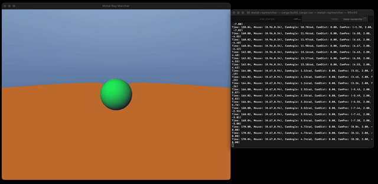

# Metal Raymarcher in Rust

## Project Overview

This is a personal learning project demonstrating a basic 3D raymarcher implemented in Rust, leveraging Apple's Metal API for GPU acceleration. The primary goal was to explore graphics programming with Metal from Rust, understand the fundamentals of raymarching, and practice GPU-CPU data communication.

## Features

*   **Raymarched Scene:** Renders a simple scene composed of Signed Distance Functions (SDFs) for basic primitives (sphere, plane).
*   **Metal Shaders:** Custom vertex and fragment shaders written in Metal Shading Language (MSL).
*   **Rust & Metal Integration:** Uses the `metal-rs` crate for interacting with the Metal API from Rust.
*   **Basic Camera Controls:**
    *   Mouse movement controls camera orientation (orbiting around the scene).
    *   Mouse scroll controls camera distance (zoom).
    *   Spacebar resets the camera view.
*   **Dynamic Uniforms:** Shader uniforms (resolution, time, mouse position, camera position) are updated from Rust each frame.
*   **Windowing & Events:** Utilizes the `winit` crate for window creation and event handling.

## Demo

Here's a quick look at the raymarcher in action:

## Learning Objectives & Outcomes

*   Gained practical experience with the Metal API and MSL.
*   Understood the core concepts of raymarching and SDFs.
*   Learned how to set up a Metal rendering pipeline in Rust, including:
    *   Shader compilation and loading.
    *   Buffer creation and data transfer (vertices, uniforms).
    *   Render pass and command encoding.
    *   Interfacing with `CAMetalLayer` for display.
*   Practiced managing GPU resources and synchronizing data between CPU and GPU.
*   Explored 3D vector math and camera transformations.

## Technology Stack

*   **Language:** Rust
*   **Graphics API:** Apple Metal
*   **Crates:**
    *   `metal-rs`: Metal API bindings
    *   `winit`: Windowing and event loop
    *   `cgmath`: Vector/matrix math
    *   `objc`: Objective-C interop
    *   `cocoa`: macOS specific functionalities (used indirectly by `winit` and `metal-rs` for layer setup)

## How to Run (macOS Only)

1.  Ensure you have the Rust toolchain and Xcode (for Metal SDK) installed.
2.  Clone the repository.
3.  Navigate to the project directory.
4.  Run `cargo run --release`.

## Reference

 [Ray marching](https://en.wikipedia.org/wiki/Ray_marching)
 [What is Ray Marching?]( https://youtu.be/TSAIR03FPfY)

## Future Exploration (Potential Next Steps)

*   Implement more complex SDFs and scene compositions.
*   Explore advanced lighting, shadows, or ambient occlusion techniques.

---

This project serves as a foundational step in my journey into graphics programming and GPU computing.

